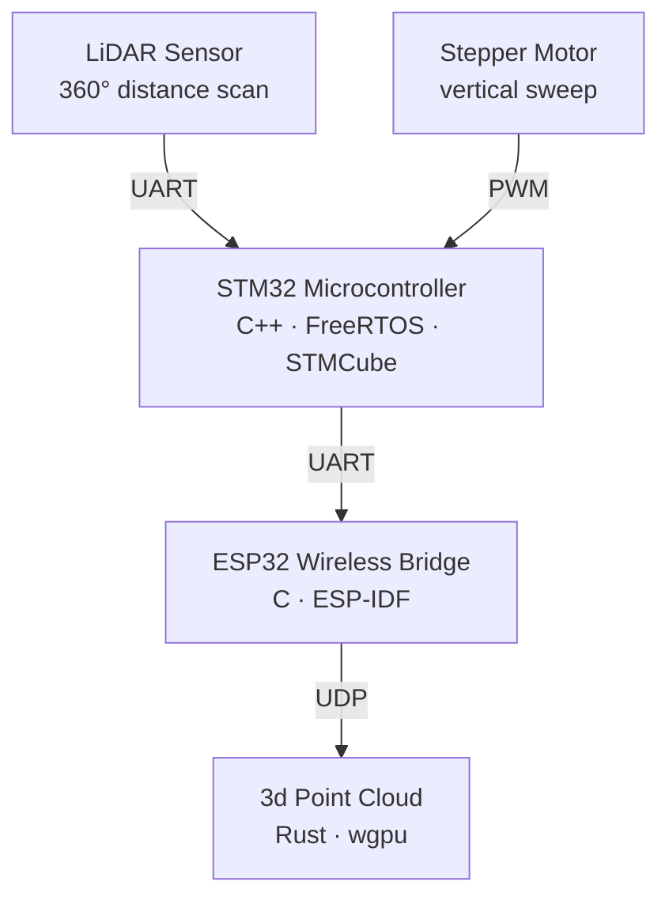

```mermaid
graph TD
    A[LiDAR Sensor\n360° distance scan] -->|UART| C
    B[Stepper Motor\nvertical sweep] -->|PWM| C
    C[STM32 Microcontroller\nC++ · FreeRTOS · STMCube]-->|UART| D
    D[ESP32 Wireless Bridge\nC · ESP-IDF] -->|UDP| E
    E[3d Point Cloud\n Rust · wgpu]
```
