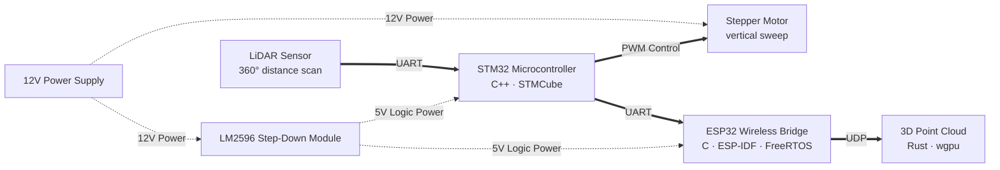

# Lidar Mapping Pipeline

A custom 3D scanning setup built with a 360° LiDAR and a stepper motor. The project focuses on low-level embedded architecture, non-blocking data processing, and wireless communication to render a real-time point cloud on the GPU.

## Features
* Data Processing: continuous sensor packets via STM32 hardware timers and DMA
* Motor Control: PWM vertical sweep with an isolated power supply
* Wireless Data Bridge: built with ESP32 and UDP
* Custom Visualization: wgpu point cloud rendering 

## Showcase

  
  

## Tech Stack
* Core: STM32F411RE, C/C++, STM32 HAL, FreeRTOS, CubeMX
* Data Bridge: ESP32, C, ESP-IDF
* Visualization: wgpu, winit, Rust

## Architecture

