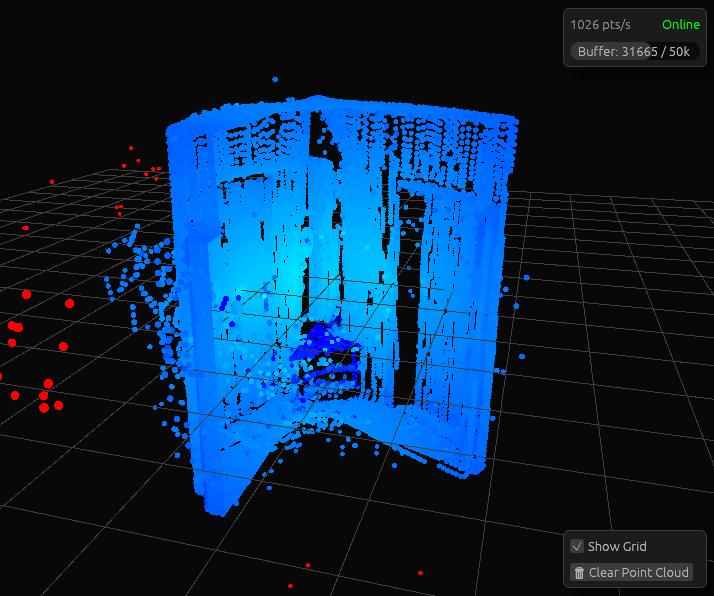
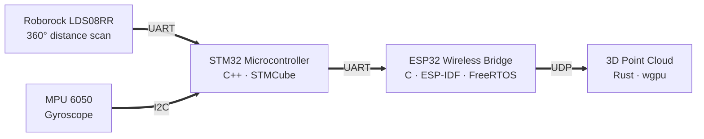

# Lidar Mapping Pipeline

A custom handheld 3D scanning setup built with a 360° LiDAR and an IMU. The project focuses on low-level embedded architecture, non-blocking data processing, and wireless communication to render a real-time point cloud on the GPU.

## Features
* Data Processing: continuous sensor packets via STM32 hardware timers and DMA
* Sensor Fusion: I2C gyro integration and 3D transformations
* Wireless Data Bridge: built with ESP32 and UDP
* Custom Visualization: wgpu point cloud rendering 

## Showcase

  
  

  
  

## Tech Stack
* Core: STM32F411RE, STM32 HAL, FreeRTOS, CubeMX, C/C++
* Sensors: LDS08RR (LiDAR), MPU6050 (IMU)
* Data Bridge: ESP32 DevKit C V2, ESP-IDF, C
* Visualization: wgpu, winit, egui, Rust

## Architecture

